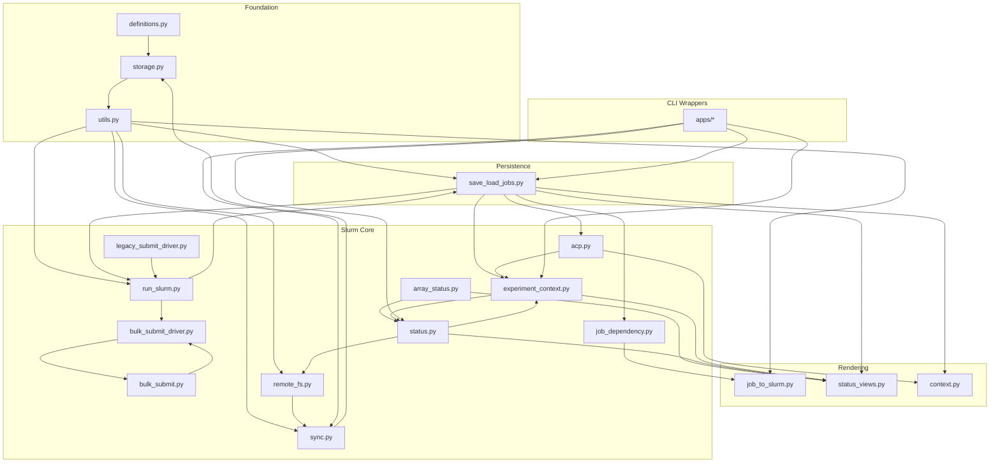

# Backend Dependency Map

This document maps the current backend dependencies between the core modules of
AutoSlurm. It is still legacy-oriented: the goal is to show how the current
backend is wired before we split it into cleaner layers.

## Layer Overview

## Direct Module Dependencies

### Foundation

- `definitions.py` provides shared constants for the rest of the package.
- `storage.py` defines the local storage layout used by almost every module.
- `utils.py` depends on `definitions.py` and `storage.py` for config and path
  helpers.

### Persistence

- `save_load_jobs.py` is the central persistence layer.
- It depends on `utils.py`, `storage.py`, `definitions.py`, and
  `job_dependency.py`.
- It is the main hub for bundle snapshots, local mirrors, and remote transfer
  helpers.

### Rendering

- `job_to_slurm.py` depends on `utils.py` and `storage.py`.
- `status_views.py` depends on `status.py` and `save_load_jobs.py`.
- `context.py` is the agent-facing bundle renderer and depends on the bundle
  snapshot and rendering stack.

### Slurm Core

- `array_status.py` is the state interpretation helper for job ids and arrays.
- `status.py` depends on `array_status.py`, `save_load_jobs.py`, and `utils.py`.
- `run_slurm.py` depends on `utils.py` and `storage.py`.
- `job_dependency.py` depends on `storage.py`.
- `bulk_submit.py` is a pure orchestration layer for dependency-level submits.
- `bulk_submit_driver.py` depends on `bulk_submit.py`.
- `legacy_submit_driver.py` depends on `run_slurm.py`.
- `remote_fs.py` depends on `storage.py` and `utils.py`.
- `sync.py` depends on `storage.py` and `utils.py`.
- `experiment_context.py` depends on `save_load_jobs.py`, `storage.py`,
  `status.py`, and `utils.py`.
- `acp.py` depends on `context.py`, `experiment_context.py`,
  `save_load_jobs.py`, and `storage.py`.

### CLI Wrappers

- The `apps/` modules are mostly entrypoints that route into the backend
  modules above.
- `apps/status.py` routes into `status.py`, `save_load_jobs.py`, and
  `status_views.py`.
- `apps/inspect.py` routes into `experiment_context.py`, `save_load_jobs.py`,
  `status_views.py`, `storage.py`, and `sync.py`.
- `apps/submit.py` routes into `utils.py`, `save_load_jobs.py`, and
  `job_runner.py`.
- `apps/sync.py` routes into `sync.py`.
- `apps/clean.py` routes into `save_load_jobs.py` and `status.py`.

## Important Internal Edges

These are the edges that matter most for understanding the current backend:

- `save_load_jobs.py` is the central state hub.
- `status.py` is the main live-Slurm query layer.
- `experiment_context.py` is the main log resolution layer.
- `run_slurm.py` is the submission transport layer.
- `job_to_slurm.py` is the script renderer.
- `sync.py` is the remote-to-local mirror boundary.
- `status_views.py` is the table/context rendering layer.

## External Tool Dependencies

- `sbatch` is used by `run_slurm.py` and the bulk-submit driver.
- `squeue` and `sacct` are used by `status.py` and log-array resolution.
- `ssh` is used by `run_slurm.py`, `status.py`, `sync.py`, and
  `experiment_context.py`.
- `rsync` is used by `sync.py`.
- `scp` is used by `save_load_jobs.py`.

## What This Map Tells Us

The current backend is not modular in the sense we want for the refactor.
Instead, it is centered on a few shared hubs:

- `save_load_jobs.py` for persistence and bundle state
- `status.py` for live cluster state
- `experiment_context.py` for logs and inspection
- `run_slurm.py` for submission transport

That is useful as a historical map, but it is also the main reason the package
feels opaque. The refactor should split these hubs into smaller, clearer
responsibilities.

