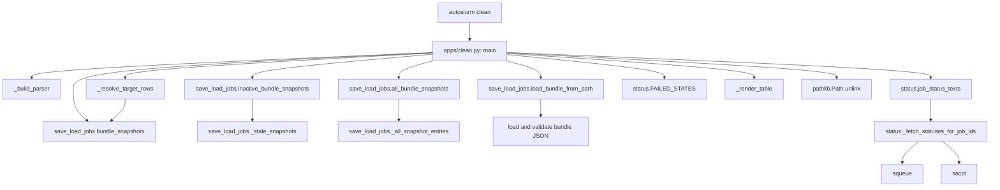

# Clean Flow

This chart shows how the current clean command decides what is inactive or
terminal before deleting snapshot files.

## Main Dependencies

- `apps/clean.py` owns the CLI and selection logic.
- `save_load_jobs.py` provides snapshot classification and visibility policy.
- `status.py` is consulted to classify submitted jobs as failed or cancelled.
- `squeue` and `sacct` can still influence the clean classification path.

