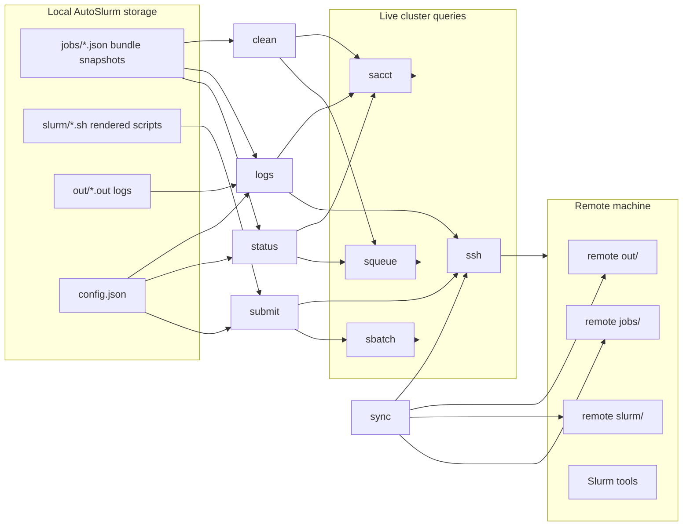

# Current AutoSlurm Architecture Flow

This chart captures the current code path as it exists today, before the
refactor introduces a local-first status and log index.

## Command Routing

```mermaid
flowchart TD
    A[autoslurm CLI entrypoint] --> B[apps/root.py dispatch]

    B --> C[submit]
    B --> D[status]
    B --> E[logs / inspect]
    B --> F[sync]
    B --> G[clean]
    B --> H[filter]
    B --> I[configuration]

    C --> C1[save/load bundle snapshot]
    C --> C2[render SLURM scripts]
    C --> C3[local or remote sbatch]
    C --> C4[record job ids back into bundle]

    D --> D1[load bundle snapshots]
    D --> D2[query live Slurm state]
    D2 --> D3[squeue]
    D2 --> D4[sacct]
    D --> D5[render bundle/job status tables]

    E --> E1[load bundle snapshots]
    E --> E2[read local .out files]
    E --> E3[optional remote fallback]
    E3 --> E4[SSH]
    E3 --> E5[sacct for array-task mapping]
    E --> E6[render bundle/job/log context]

    F --> F1[pull remote jobs/ slurm/ out/]
    F --> F2[mirror remote storage locally]

    G --> G1[load bundle snapshots]
    G --> G2[derive stale or terminal snapshots]
    G2 --> G3[may query live job state]
    G --> G4[optionally delete selected snapshots]

    H --> H1[set or read global bundle visibility filter]

    I --> I1[load or save config]
    I --> I2[SSH and machine setup]
```

## Data Flow

## Current Bottlenecks

- `status` depends on live accounting queries.
- `logs` depends on local log files and array-task id mapping.
- array-task mapping can fall back to `sacct`.
- `clean` mixes snapshot policy with live status checks.
- the CLI layer still carries too much of the orchestration logic.

## Code References

- CLI dispatch: [autoslurm/src/autoslurm/apps/root.py](/home/alexandre/Desktop/Projects/substructure/autoslurm/src/autoslurm/apps/root.py)
- Submit path: [autoslurm/src/autoslurm/apps/submit.py](/home/alexandre/Desktop/Projects/substructure/autoslurm/src/autoslurm/apps/submit.py)
- Status path: [autoslurm/src/autoslurm/status.py](/home/alexandre/Desktop/Projects/substructure/autoslurm/src/autoslurm/status.py)
- Logs and inspect path: [autoslurm/src/autoslurm/experiment_context.py](/home/alexandre/Desktop/Projects/substructure/autoslurm/src/autoslurm/experiment_context.py)
- Sync path: [autoslurm/src/autoslurm/apps/sync.py](/home/alexandre/Desktop/Projects/substructure/autoslurm/src/autoslurm/apps/sync.py)
- Clean path: [autoslurm/src/autoslurm/apps/clean.py](/home/alexandre/Desktop/Projects/substructure/autoslurm/src/autoslurm/apps/clean.py)

