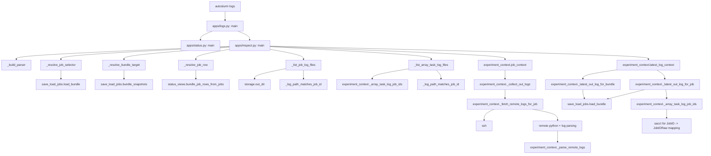

# Logs Flow

This chart shows how the current logs and inspect commands traverse bundle
snapshots, local output files, and remote fallbacks.

## Main Dependencies

- `apps/logs.py` is only a thin dispatcher.
- `apps/inspect.py` does most of the CLI selection and rendering work.
- `experiment_context.py` handles the log aggregation, fallback fetching, and
  array-task raw-id resolution.
- `save_load_jobs.py` supplies bundle snapshots and saved bundle paths.
- `storage.py` supplies the local output directory.
- `sacct` is used when the code needs to resolve array-task log ids.

