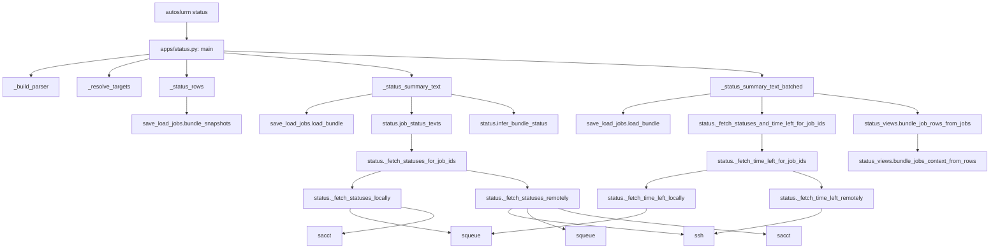

# Status Flow

This chart shows how the current status command reaches from the CLI to the
Slurm query helpers and bundle rendering helpers.

## Main Dependencies

- `apps/status.py` owns CLI parsing, date selection, and summary formatting.
- `save_load_jobs.py` provides bundle snapshots and bundle loading.
- `status.py` performs the actual Slurm lookups and status inference.
- `status_views.py` renders the bundle/job tables.
- `squeue`, `sacct`, and `ssh` are the live external tools used by the current
  implementation.

