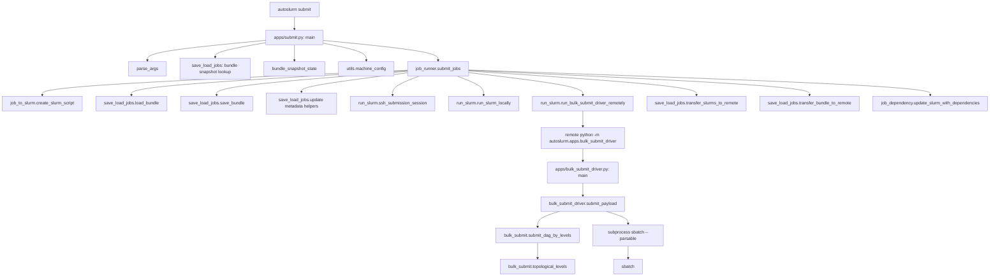

# Submit Flow

This chart shows the current submission path from the CLI down to the Slurm
and storage helpers.

## Main Dependencies

- CLI parsing and bundle selection happen in `apps/submit.py`.
- Job rendering happens in `job_to_slurm.py`.
- Submission transport happens in `run_slurm.py`.
- Dependency ordering and DAG level handling happen in `job_dependency.py` and
  `bulk_submit.py`.
- Remote bulk submission uses the remote Python entrypoint in
  `apps/bulk_submit_driver.py`.

