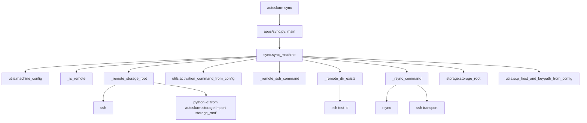

# Sync Flow

This chart shows how the current sync command discovers the remote storage root
and mirrors the remote storage directories locally.

## Main Dependencies

- `apps/sync.py` is just the CLI wrapper.
- `sync.py` handles machine resolution, remote path discovery, and rsync calls.
- `utils.py` provides machine configuration and SSH helpers.
- `storage.py` provides the local root and directory layout.
- `ssh` and `rsync` are the external tools that actually move data.

